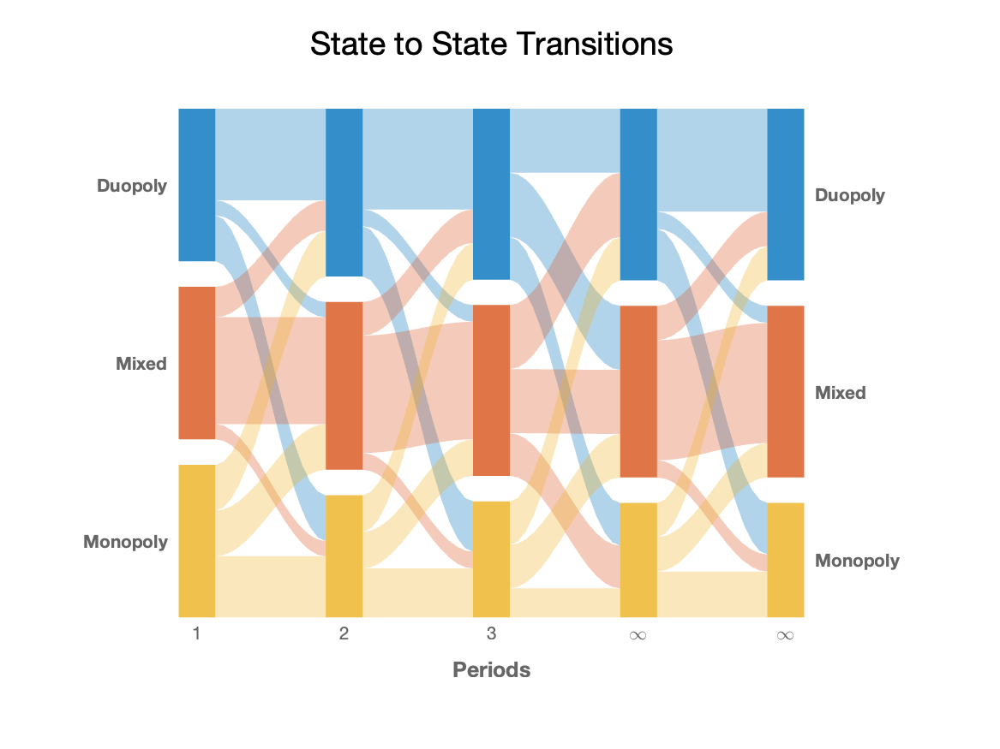

# Alluvial Markow Chart
by [Matteo Courthoud](https://matteocourthoud.github.io/)

class file: `alluvial.m`

example file: `example.m`

---

This class produces alluvial diagrams from a Markow transition matrix. It displays the probability distribution over states at different points in time.

```
Q = [0.6 0.1 0.3
     0.2 0.7 0.1
     0.3 0.3 0.4];
```

The user specifies the iterations at which the distribution over states has to be displayed. For example, we want to shot the first three time periods, the 99th and the 100th.

```
x = [1, 2, 3, 99, 100];
```

They the user provides labels for the classes, the time steps and the title of the graph.

```
ylabels = ["Duopoly", "Mixed", "Monopoly"];
xlabels = ["1", "2", "3", "\infty", "\infty"];
title = "State to State Transitions";
```

The `plot_transitions`command produces the final output.

