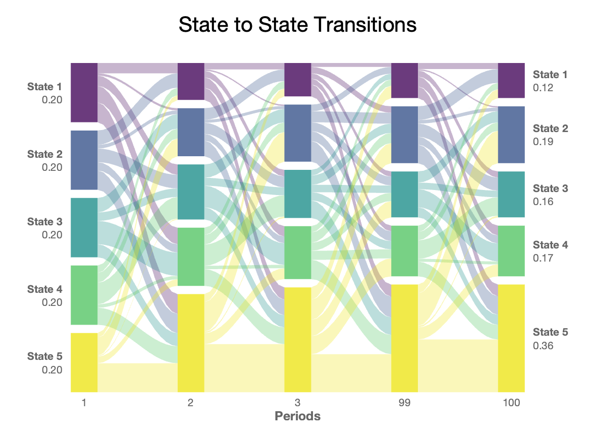
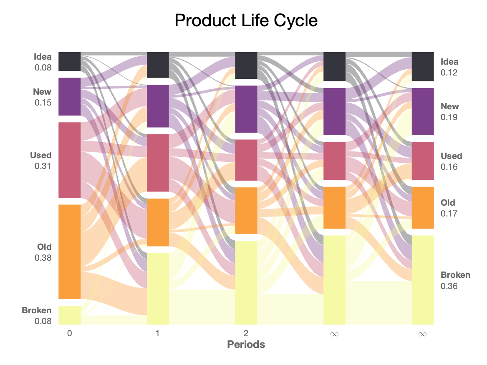

# Alluvial Markow Chart
by [Matteo Courthoud](https://matteocourthoud.github.io/)

class file: `alluvial.m`

example file: `example.m`

---

This class produces alluvial diagrams from a Markow transition matrix. It displays the probability distribution over states at different points in time.

```
rng(1);
Q = rand(5);
Q = Q ./ sum(Q,2);
```

The user specifies the iterations at which the distribution over states has to be displayed. For example, we want to shot the first three time periods, the 99th and the 100th.

```
x = [1, 2, 3, 99, 100];
```

The `plot_transitions`command produces the final output.

```
alluvial.plot_transitions(Q, x, ylabels, xlabels, title);
```



Additionally, the user can provide the following options:

- `w0`: initial state distribution
- `xlabels`: labels of the horizontal axis
- `ylabels`: labels of the vertical axis
- `title`: title of the graph
- `palette`: color palette among viridian (default), inferno, magma, plasma

```
w0 = [1, 2, 4, 5, 1];
ylabels = ["Idea", "New", "Used", "Old", "Broken"];
xlabels = ["0", "1", "2", "\infty", "\infty"];
palette = "inferno";
title = "Product Life Cycle";
```

The parameters are inputed the MATLAB way.

```
 alluvial.plot_transitions(Q, x, "w0", w0, "palette", palette, "ylabels", ylabels, "xlabels", xlabels,  "title", title);
```



